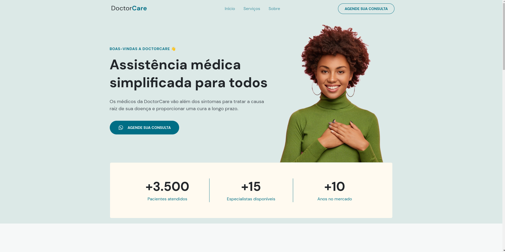
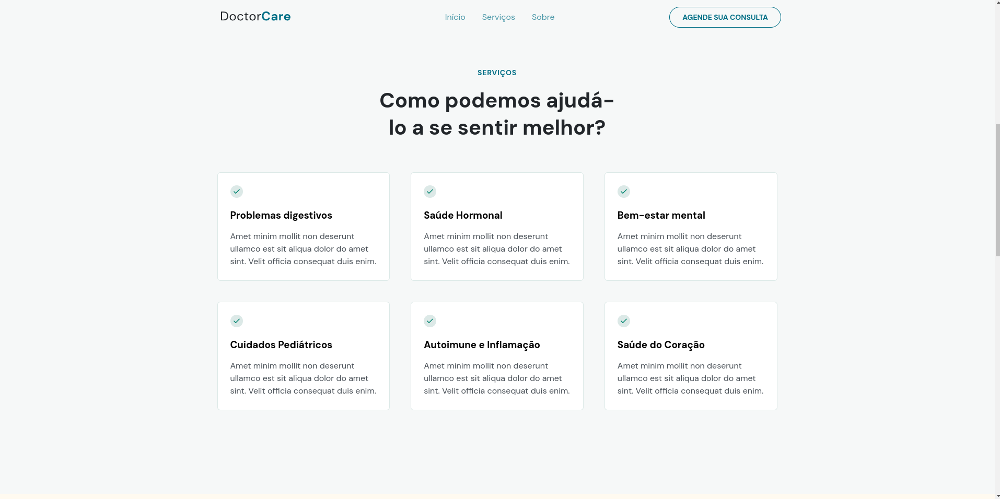
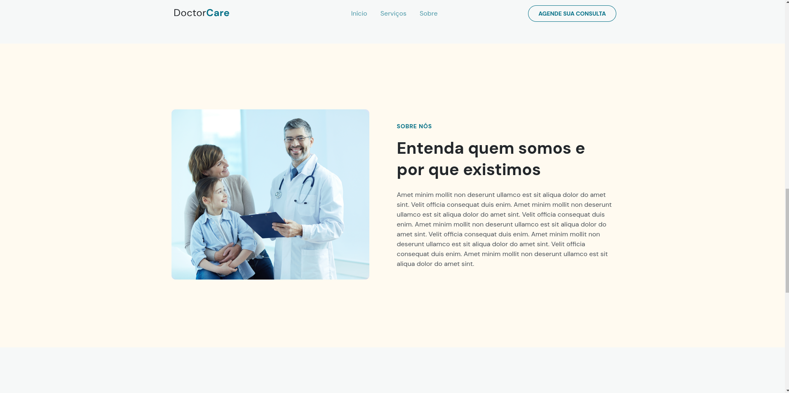
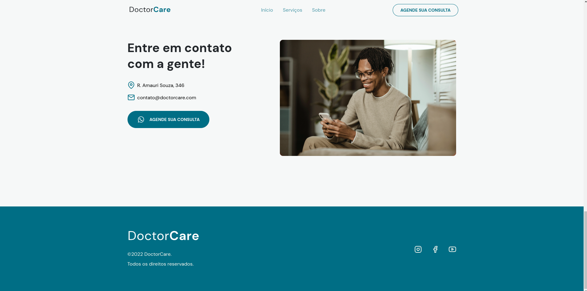

# Doctor Care

## Feito com HTML, CSS e JS.

  
  
  
  

# Funcionalidades

* Botôes dinâmicos
* Responsividade

# Tecnologias Utilizadas

* JavaScript - Para lógica de programação e interação 

* CSS - Para estilização da interface

# Conceitos Abordados

* Funções, eventos, condicionais, etc.

# Como utilizar

1- Clone o projeto
`git@github.com:helen-andrade/doctorcare-main.git`

2- Instale as dependências
`npm i`

3- Rode o script de desenvolvimento
`npm run dev`

---

    
Feito com ♡ por Helen Andrade

